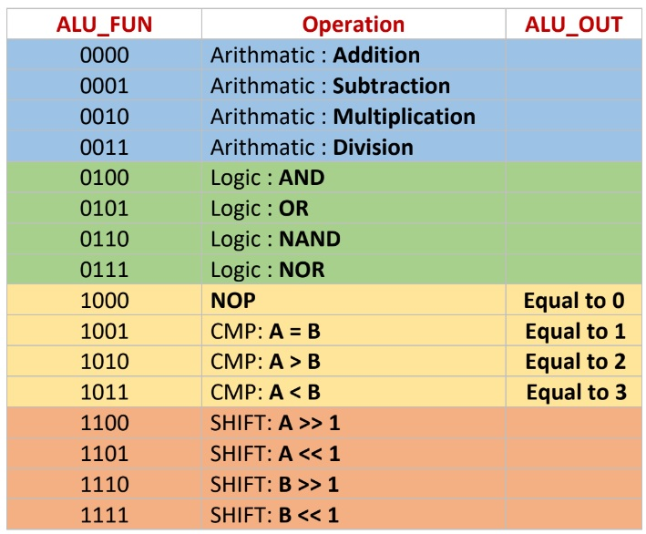

# 16-bit ALU
 16-bit ALU for arithmetic, logic, shift and comparison operations.
 Decoder Unit to enable which function to operate.

 ### IO:
* `A` - **[input]** 
* `B` - **[input]** 
* `ALU_FUN` - **[input]** 
* `CLK` - **[input]** 
* `RST` - **[input]** 

* `Arith_OUT` - **[output]** 
* `Carry_OUT` - **[output]** 
* `Arith_Flag` - **[output]** 
* `Logic_OUT` - **[output]** 
* `Logic_Flag` - **[output]** 
* `CMP_OUT` - **[output]** 
* `CMP_Flag` - **[output]** 
* `SHIFT_OUT` - **[output]** 
* `SHIFT_Flag` - **[output]** 

### ALU_FUN Table:
